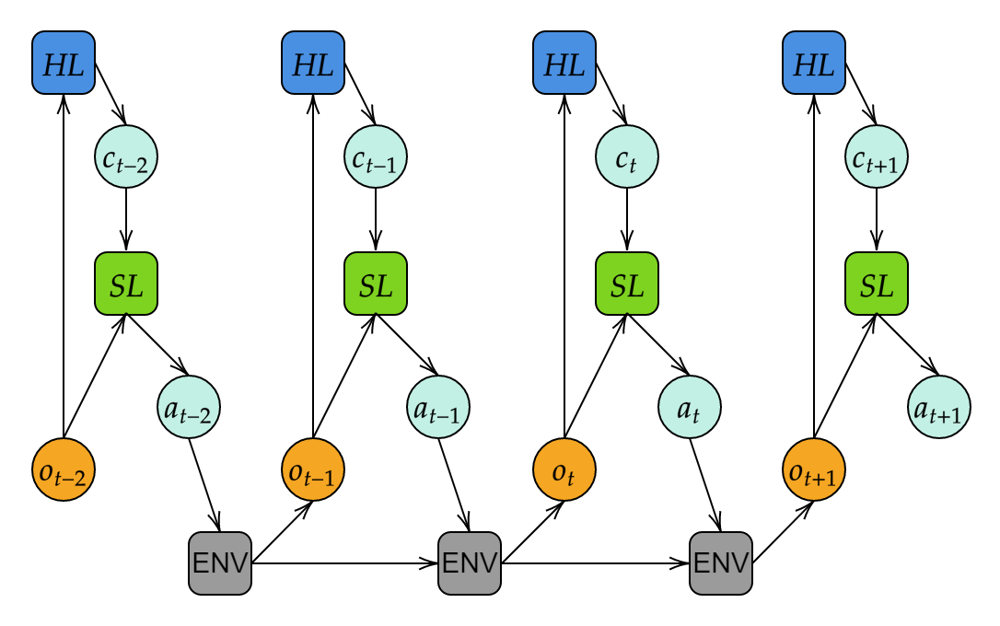
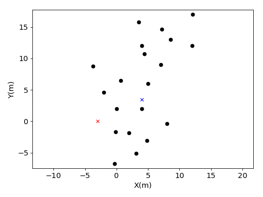

# A Reinforcement Learning Based Multiple Strategy Framework for Tracking a Moving Target

In order to combine the robustness of classical control strategies with the adaptive characteristics of reinforcement learning, this hierarchical control framework was proposed. A neural networks is in the high level (HL). It determines which classical control method to be adopted with observations. In the strategy level (SL), the strategy chosen by the control signal ($c_t$) perform the actual action. This idea is inspired from [the hierarchical reinforcement learning](https://arxiv.org/abs/1610.05182).

Compared to the end-to-end design, this hierarchical design has following advantages:
- Easy to train. For the high level network, the action space is simplified into discrete, highly reduce the exploration space of the agent.
- Interpretability. The lower layer of the framework is not a neural network, but a classical control algorithm, thus the agent's performance can be analysed.
- Multiple timescales: The lower controller runs at the base frequency (such as the simulated world clock), while the upper layer updates the strategy at a slower frequency.
<!-- 
The insight of this design is the replacement of part of the neural network with a manual design strategy, thus expecting to capture advantages of both methods. -->

For the specific situation, i.e. robot pursuit evasion, two navigation algorithms are adopted: a dynamic window approach and a potential field approach. 

The demo is based on [gym](https://github.com/openai/gym) and [stable_baselines](https://github.com/Stable-Baselines-Team/stable-baselines). Prerequisite:
```
pip install gym==0.14.0
pip install tensorflow==1.14
pip install stable-baselines
```
Then 
```
python training_robot.py
```


